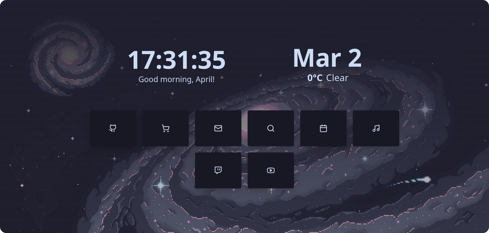

<p align="center">
    
</p>
<h1 align="center">Newt</h1>

<p align="center">A simple and friendly custom new tab page</p>



<p align="center">
    
    
</p>

# Welcome to Newt!

Newt is a customizable new tab page designed to be simple and easy to use. Here's what makes it special:

- **Clean, Minimalist Interface:** Inspired by the idea that simplicity is key.
- **Personalized Just for You:** Customize everything to match your style, from colors to greetings!
- **Weather at a Glance:** See the current temperature and weather conditions quickly and easily. (Supports Celsius, Fahrenheit, and Kelvin)
- **Quick Access Bookmarks:** Add your favorite links as buttons with elegant icons from Lucide.

Get started by reading the guide below!

# Getting started

Setting up Newt couldn't be simpler, just follow the steps below!

<!-- no toc -->

1. [Get a local copy](#getting-a-local-copy)
2. [Customize](#customizing)
3. [Deploy your site](#deploying)
4. [Set it as your newtab page](#set-newt-as-your-newtab)
5. Enojy!

## Getting a Local Copy

Before anything else, you need a copy of Newt on your computer. Make sure that you have [Git](https://git-scm.com/) and [NPM](https://docs.npmjs.com/downloading-and-installing-node-js-and-npm) (or an NPM compatible package manager) installed and a GitHub account, then follow the steps below.

1. Fork the repo by scrolling to the top of this page and clicking the `Fork` button.
2. In new page that shows up, click the `Create fork` button.
3. Once everything finishes loading, click the green `Code` button at the top of the page.
4. Copy the URL that appears.
5. From your command line, run the following:

   ```bash
   git clone URL
   ```

   where `URL` is the URL you copied in step 4. This will download all of the code locally.

6. From your command line, run the following:

   ```bash
   npm install
   ```

   This will install all of the dependencies you need to preview your changes locally.

You are now ready to continue to the

## Customizing

> [!TIP]
> Before you start customizing, to see your changes real-time you should run `npm run dev`, and then visit `http://localhost:4321` in your browser.

Newt's behavior is controlled by `config.ts`. Below is an overview of each section you can modify:

- **name:** Set your name for the greetings.
- **locale:** Language and regional settings for date/time.
- **midgap:** Adjust spacing between buttons and the time/weather display.

- **colors:**

  - `baseBg`: Main background color.
  - `darkBg`: A darker background variant, used for the buttons.
  - `accent`: Accent or highlight color, used for hovered buttons.
  - `textPrimary`: Main text color.
  - `textSecondary`: Secondary text color (e.g., for headings or buttons). If you don't know what to pick, setting this to be the same as `baseBg` usually works out.

- **buttons:**

  - `gap`: Space between individual buttons.
  - `buttons`: An array of button objects; each needs a `name`, `href`, and `icon` (from [Lucide](https://lucide.dev)).

- **image:**

  - `enabled`: Toggles wether or not your background image is shown.
  - `src`: Path to your preferred background image file. It is reccomended you put them in `/public`, so the image is on the same server as the rest of your instance and will load faster.

- **greetings:**

  - `morning`: Adjust the greeting text for the morning.
  - `evening`: Adjust the greeting text for the afternoon/evening.
  - `night`: Adjust the greeting text for the night.
  - `late`: Adjust the greeting text for the very late night / early morning.
  - `punc`: The punctuation that is displayed at the end of the greeting. (`!` or `.`)

    Time ranges for each greeting:

    | Greeting | 24‑hour range | 12‑hour range    |
    | -------- | ------------- | ---------------- |
    | morning  | 06:00–11:59   | 6:00 AM–11:59 AM |
    | evening  | 12:00–16:59   | 12:00 PM–4:59 PM |
    | night    | 17:00–22:59   | 5:00 PM–10:59 PM |
    | late     | 23:00–05:59   | 11:00 PM–5:59 AM |

- **dateFormat:** Conventional date formatting rules (e.g., month/day style). API compatible with the JavaScript `new Date().toLocaleString()` options input.

- **time:**

  - `seconds`: Show or hide seconds.
  - `twelveHour`: Switch between 12hr or 24hr time format.

- **weather:**

  - `coordinates`: Your latitude/longitude.
  - `units`: Metric (`C°`), Imperial (`F°`), or Standard (`K`).

> [!IMPORTANT]
> For weather to work, you must get an OpenWeatherMap API Key from https://openweathermap.org/api/one-call-3#start, and complete the following steps:
>
> - Go to the settings tab of your fork
> - Click on "Secrets and variables" and then "Actions" in the menu that appears under it
> - Click "New Repository Secret"
> - Set the name to be `WEATHER_API_KEY`
> - Set the secret to be the API Key you got from OpenWeatherMap
> - Click "New Secret"
>
> If you are still reciving the error that says "Weather API key not configured", you may need to click on `Actions > Deploy to GitHub Pages > Run Workflow` (in the top bar) to re-build newt.

## Deploying

To deploy Newt to a website, we're going to use GitHub pages for the sake of simplicity.

1. Click the "Actions" button in the bar at the top
2. Click the "I understand my workdlows" button
3. Open the repository’s "Settings" tab.
4. In the "Pages" section, set "Source" to "GitHub Actions"
5. Go back to your CLI, and run `git commit -am "Update config"`, and then `git push` to send your changes to the remote repo.
6. Visit the provided GitHub Pages URL to see your deployed site. Unless you named your fork something other than "newt", your url should be `https://[yourusername].github.io/newt`, where `[yourusername]` is your github username.

## Set Newt as your newtab

There aren't any browsers I know of that natively let you set a custom newtab page, so here are the extensions/plugins that I use for the two big browser engines.

- **Chrome:** [Custom New Tab](https://chromewebstore.google.com/detail/custom-new-tab/lfjnnkckddkopjfgmbcpdiolnmfobflj?hl=en-US) by dicanote.co
- **Firefox:** [Custom New Tab Page](https://addons.mozilla.org/en-US/firefox/addon/custom-new-tab-page/) by MethodGrab
